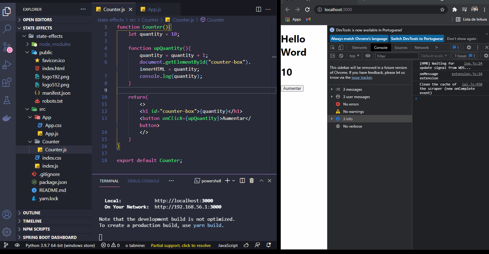
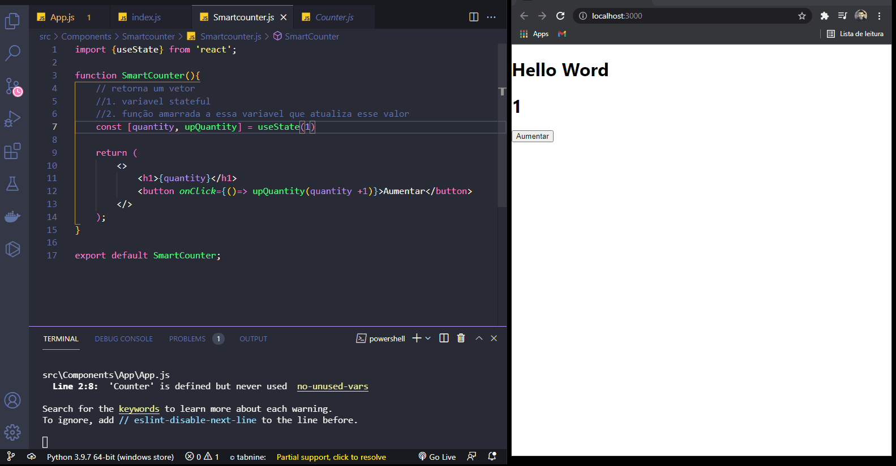
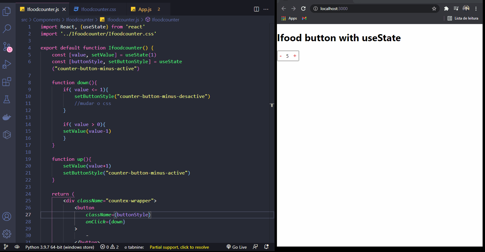
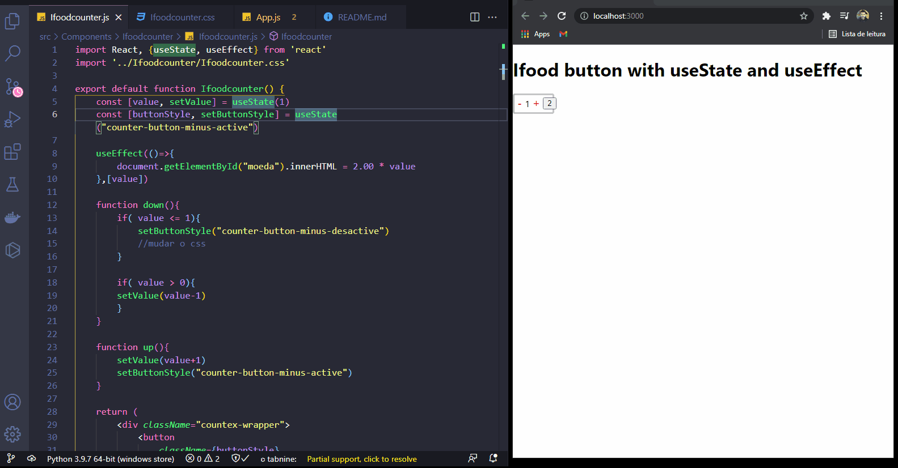

<h1 align="center">
  
   
  Working with useState and useEffect
</h1>

<h3 align="justify">
Didactic demonstration of useState and useEffect hooks. Also, a comparison of an application with and without useState. Credits for Digital Innovation One, Working with States & Effects course at ReactJs, professor Felipe Aguiar.
</h3>

 

## 📷 Demonstration

<h4 align="left">no useState</h4>
  

<h4 align="left">With useState</h4>
  

<h4 align="left">Ifood button with useState</h4>
  

<h4 align="left">Ifood button with useState and useEffect</h4>
  

 

## 🚀 Technologies

This project was developed with the following technologies:

- ReactJS
- JavaScript ES6
- Nodejs
- HTML5
- CSS3
- useState
- useEffect

 

## ⚙ Commands Running locally Client
- npm start

## ⚙ Sources
- pt-br.reactjs.org

 

Made with 💜 by Rafael Maciel
